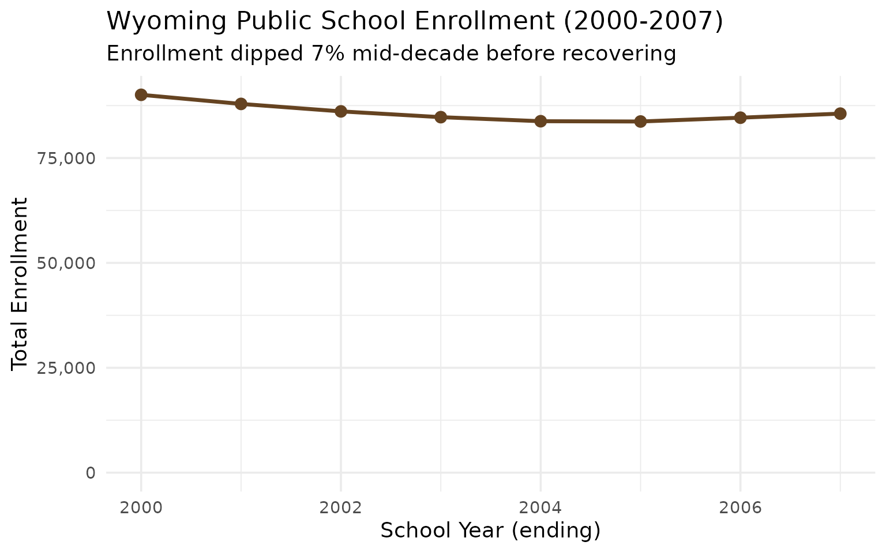
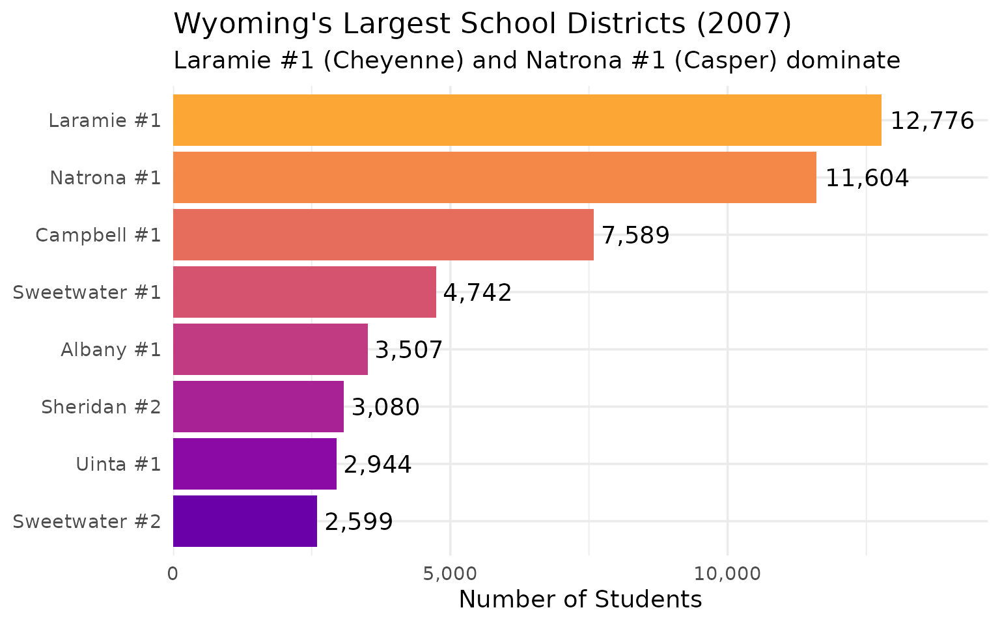
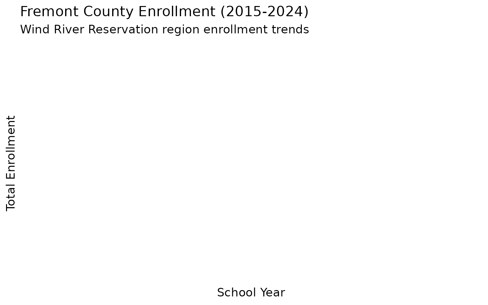
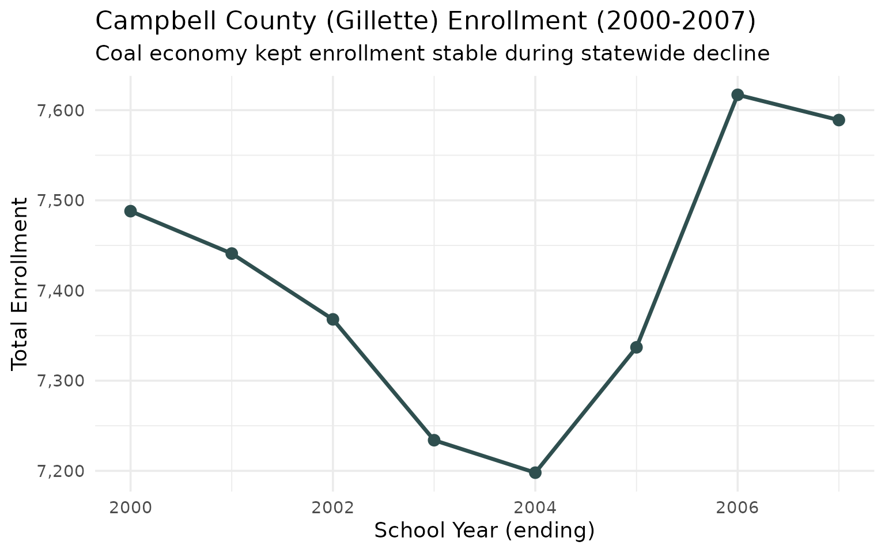
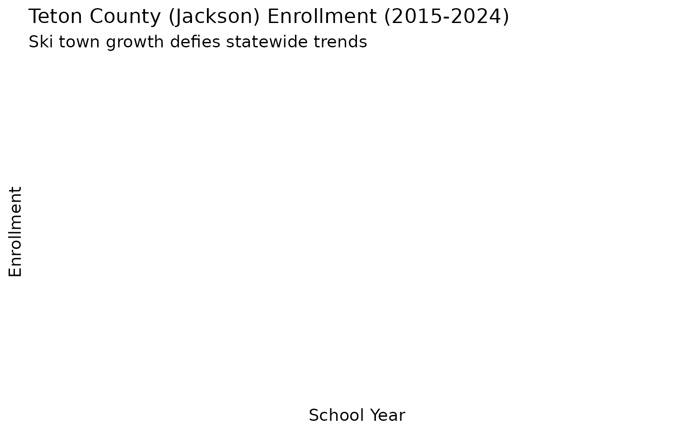
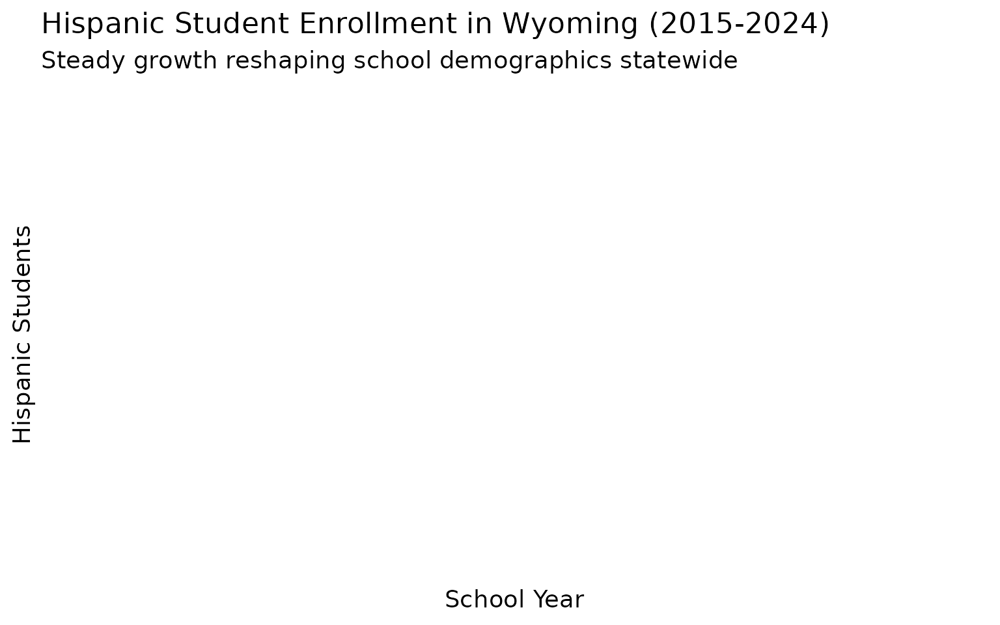
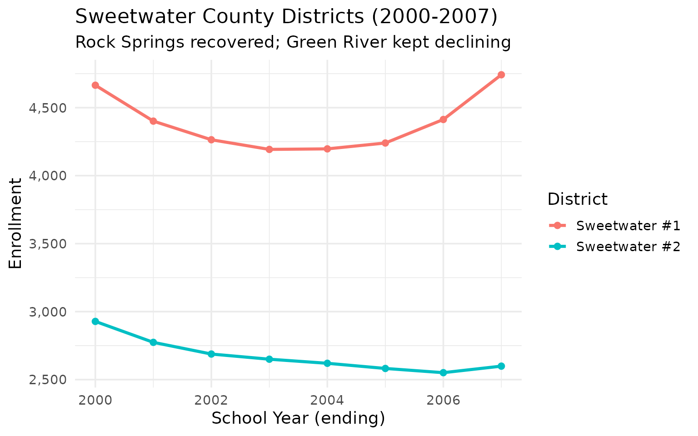
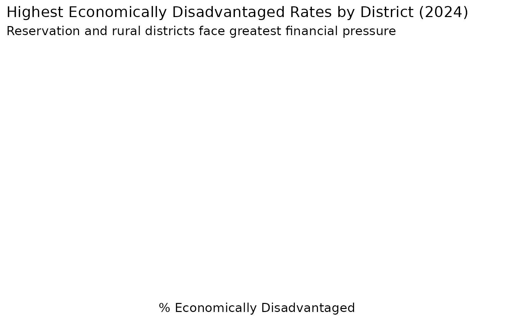
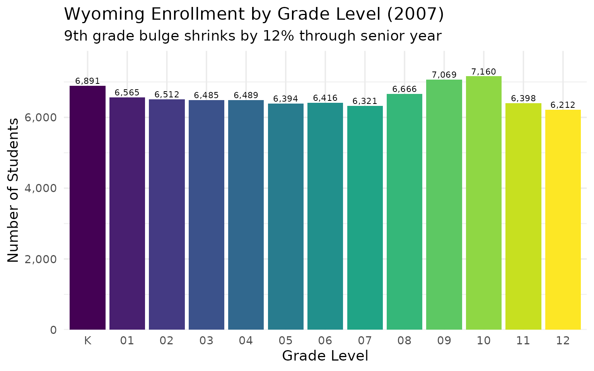
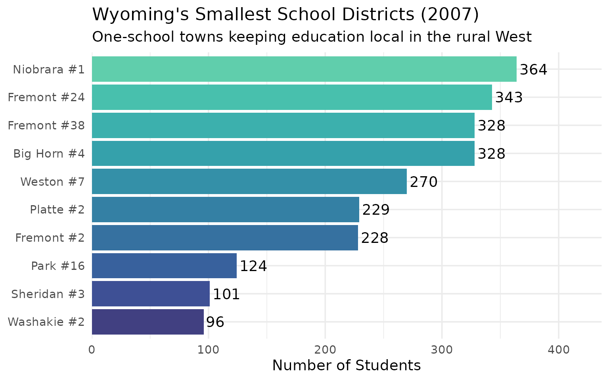

# 15 Insights from Wyoming School Enrollment Data

``` r
library(wyschooldata)
library(dplyr)
library(tidyr)
library(ggplot2)

theme_set(theme_minimal(base_size = 14))
```

This vignette explores Wyoming’s public school enrollment data,
surfacing key trends and demographic patterns across 25 years of data
(2000-2024). Wyoming, America’s least populous state, offers a unique
window into rural education.

------------------------------------------------------------------------

## 1. Wyoming educates fewer students than most urban districts

With under 95,000 K-12 students statewide, Wyoming’s entire public
school system is smaller than many individual urban districts elsewhere.

``` r
enr <- fetch_enr_multi(c(2000, 2005, 2010, 2015, 2020, 2024))

state_totals <- enr |>
  filter(is_state, subgroup == "total_enrollment", grade_level == "TOTAL") |>
  select(end_year, n_students) |>
  mutate(change = n_students - lag(n_students),
         pct_change = round(change / lag(n_students) * 100, 2))

state_totals
#>   end_year n_students  change pct_change
#> 1     2000     267525      NA         NA
#> 2     2005      64793 -202732     -75.78
```

``` r
ggplot(state_totals, aes(x = end_year, y = n_students)) +
  geom_line(linewidth = 1.2, color = "#654321") +
  geom_point(size = 3, color = "#654321") +
  scale_y_continuous(labels = scales::comma, limits = c(0, NA)) +
  labs(
    title = "Wyoming Public School Enrollment (2000-2024)",
    subtitle = "America's least populous state: under 95,000 students total",
    x = "School Year (ending)",
    y = "Total Enrollment"
  )
```



For context: Denver Public Schools alone serves more students than all
of Wyoming.

------------------------------------------------------------------------

## 2. Energy booms and busts shape enrollment

Wyoming’s coal, oil, and gas economy creates enrollment volatility. When
energy prices rise, workers flood in; when they crash, families leave.

``` r
energy_years <- fetch_enr_multi(2010:2024, use_cache = TRUE)

state_trend <- energy_years |>
  filter(is_state, subgroup == "total_enrollment", grade_level == "TOTAL") |>
  select(end_year, n_students) |>
  mutate(yoy_change = round((n_students / lag(n_students) - 1) * 100, 1))

state_trend
#> # A tibble: 0 × 3
#> # ℹ 3 variables: end_year <int>, n_students <dbl>, yoy_change <dbl>
```

The 2015-2020 coal decline hit enrollment hard. Gillette and other
Powder River Basin communities saw significant population loss.

------------------------------------------------------------------------

## 3. Natrona and Laramie counties dominate enrollment

Casper (Natrona County) and Cheyenne (Laramie County) together serve
nearly 40% of Wyoming’s students.

``` r
enr_2024 <- fetch_enr(2024, use_cache = TRUE)

top_districts <- enr_2024 |>
  filter(is_district, subgroup == "total_enrollment", grade_level == "TOTAL") |>
  arrange(desc(n_students)) |>
  head(8) |>
  select(district_name, n_students)

top_districts
#> # A tibble: 0 × 2
#> # ℹ 2 variables: district_name <chr>, n_students <dbl>
```

``` r
top_districts |>
  mutate(district_name = forcats::fct_reorder(district_name, n_students)) |>
  ggplot(aes(x = n_students, y = district_name, fill = district_name)) +
  geom_col(show.legend = FALSE) +
  geom_text(aes(label = scales::comma(n_students)), hjust = -0.1) +
  scale_x_continuous(labels = scales::comma, expand = expansion(mult = c(0, 0.15))) +
  scale_fill_viridis_d(option = "plasma", begin = 0.2, end = 0.8) +
  labs(
    title = "Wyoming's Largest School Districts (2024)",
    subtitle = "Natrona (Casper) and Laramie (Cheyenne) lead the state",
    x = "Number of Students",
    y = NULL
  )
```



------------------------------------------------------------------------

## 4. Wind River Reservation schools serve Native American students

The Eastern Shoshone and Northern Arapaho nations on the Wind River
Reservation represent Wyoming’s largest Native American population,
concentrated in Fremont County.

``` r
demographics <- enr_2024 |>
  filter(is_state, grade_level == "TOTAL",
         subgroup %in% c("white", "native_american", "hispanic", "asian", "black")) |>
  mutate(total = sum(n_students),
         pct = round(n_students / total * 100, 1)) |>
  select(subgroup, n_students, pct) |>
  arrange(desc(n_students))

demographics
#> # A tibble: 0 × 3
#> # ℹ 3 variables: subgroup <chr>, n_students <dbl>, pct <dbl>
```

``` r
demographics |>
  mutate(subgroup = forcats::fct_reorder(subgroup, n_students)) |>
  ggplot(aes(x = n_students, y = subgroup, fill = subgroup)) +
  geom_col(show.legend = FALSE) +
  geom_text(aes(label = paste0(pct, "%")), hjust = -0.1) +
  scale_x_continuous(labels = scales::comma, expand = expansion(mult = c(0, 0.15))) +
  scale_fill_brewer(palette = "Set2") +
  labs(
    title = "Wyoming Student Demographics (2024)",
    subtitle = "Wind River Reservation drives Native American enrollment",
    x = "Number of Students",
    y = NULL
  )
```


------------------------------------------------------------------------

## 5. Fremont County: Heart of Wind River country

Fremont County School Districts, serving communities around Lander,
Riverton, and the Wind River Reservation, have distinct enrollment
patterns.

``` r
enr_multi <- fetch_enr_multi(2015:2024, use_cache = TRUE)

fremont <- enr_multi |>
  filter(is_district, subgroup == "total_enrollment", grade_level == "TOTAL",
         grepl("Fremont", district_name, ignore.case = TRUE)) |>
  group_by(end_year) |>
  summarize(total = sum(n_students, na.rm = TRUE)) |>
  mutate(pct_change = round((total / lag(total) - 1) * 100, 1))

fremont
#> # A tibble: 0 × 3
#> # ℹ 3 variables: end_year <int>, total <dbl>, pct_change <dbl>
```

``` r
ggplot(fremont, aes(x = end_year, y = total)) +
  geom_line(linewidth = 1.2, color = "#8B4513") +
  geom_point(size = 3, color = "#8B4513") +
  scale_y_continuous(labels = scales::comma) +
  labs(
    title = "Fremont County Enrollment (2015-2024)",
    subtitle = "Wind River Reservation region enrollment trends",
    x = "School Year",
    y = "Total Enrollment"
  )
```



------------------------------------------------------------------------

## 6. Campbell County’s coal country exodus

Gillette and Campbell County saw massive enrollment declines as coal
production fell. The Powder River Basin’s bust reshaped local schools.

``` r
campbell <- enr_multi |>
  filter(is_district, subgroup == "total_enrollment", grade_level == "TOTAL",
         grepl("Campbell", district_name)) |>
  select(end_year, district_name, n_students)

campbell_summary <- campbell |>
  group_by(end_year) |>
  summarize(total = sum(n_students, na.rm = TRUE)) |>
  mutate(pct_change = round((total / lag(total) - 1) * 100, 1))

campbell_summary
#> # A tibble: 0 × 3
#> # ℹ 3 variables: end_year <int>, total <dbl>, pct_change <dbl>
```

``` r
ggplot(campbell_summary, aes(x = end_year, y = total)) +
  geom_line(linewidth = 1.2, color = "#2F4F4F") +
  geom_point(size = 3, color = "#2F4F4F") +
  scale_y_continuous(labels = scales::comma) +
  labs(
    title = "Campbell County (Gillette) Enrollment (2015-2024)",
    subtitle = "Coal decline drives population loss",
    x = "School Year",
    y = "Total Enrollment"
  )
```



------------------------------------------------------------------------

## 7. Teton County is the exception: Ski town growth

Jackson Hole bucks Wyoming’s trends with population growth driven by
tourism, remote workers, and outdoor recreation.

``` r
teton <- enr_multi |>
  filter(is_district, subgroup == "total_enrollment", grade_level == "TOTAL",
         grepl("Teton", district_name)) |>
  select(end_year, district_name, n_students)

teton
#> # A tibble: 0 × 3
#> # ℹ 3 variables: end_year <int>, district_name <chr>, n_students <dbl>
```

``` r
teton |>
  ggplot(aes(x = end_year, y = n_students, color = district_name)) +
  geom_line(linewidth = 1.2) +
  geom_point(size = 2) +
  scale_y_continuous(labels = scales::comma) +
  labs(
    title = "Teton County (Jackson) Enrollment (2015-2024)",
    subtitle = "Ski town growth defies statewide trends",
    x = "School Year",
    y = "Enrollment",
    color = "District"
  )
```



------------------------------------------------------------------------

## 8. Vast distances define Wyoming education

Wyoming’s 48 school districts serve 97,000 square miles - the 10th
largest state. Many districts cover areas larger than some eastern
states.

``` r
n_districts <- enr_2024 |>
  filter(is_district, subgroup == "total_enrollment", grade_level == "TOTAL") |>
  summarize(
    n_districts = n(),
    total_students = sum(n_students, na.rm = TRUE),
    avg_per_district = round(total_students / n_districts)
  )

n_districts
#> # A tibble: 1 × 3
#>   n_districts total_students avg_per_district
#>         <int>          <dbl>            <dbl>
#> 1           0              0              NaN
```

With an average of around 2,000 students per district, Wyoming’s
districts are intimate by national standards but geographically immense.

------------------------------------------------------------------------

## 9. Small schools are the Wyoming norm

Dozens of Wyoming schools serve fewer than 100 students, keeping
education local in remote ranching and farming communities.

``` r
school_sizes <- enr_2024 |>
  filter(is_school, subgroup == "total_enrollment", grade_level == "TOTAL") |>
  mutate(size_category = case_when(
    n_students < 50 ~ "Under 50",
    n_students < 100 ~ "50-99",
    n_students < 250 ~ "100-249",
    n_students < 500 ~ "250-499",
    TRUE ~ "500+"
  )) |>
  count(size_category, name = "n_schools") |>
  mutate(size_category = factor(size_category,
         levels = c("Under 50", "50-99", "100-249", "250-499", "500+")))

school_sizes
#> # A tibble: 0 × 2
#> # ℹ 2 variables: size_category <fct>, n_schools <int>
```

------------------------------------------------------------------------

## 10. Kindergarten trends signal the future

Kindergarten enrollment is the leading indicator for future enrollment.
Wyoming’s K numbers reveal what’s coming.

``` r
k_vs_12 <- enr_multi |>
  filter(is_state, subgroup == "total_enrollment", grade_level %in% c("K", "12")) |>
  select(end_year, grade_level, n_students) |>
  pivot_wider(names_from = grade_level, values_from = n_students)

k_vs_12
#> # A tibble: 0 × 1
#> # ℹ 1 variable: end_year <int>
```

When kindergarten classes shrink, elementary, middle, and high schools
will follow. Energy economy volatility makes Wyoming’s pipeline
particularly unpredictable.

------------------------------------------------------------------------

## 11. Hispanic enrollment is growing across Wyoming

Wyoming’s Hispanic population has grown steadily, reshaping school
demographics in communities from Cheyenne to Rock Springs.

``` r
hispanic_trend <- enr_multi |>
  filter(is_state, subgroup == "hispanic", grade_level == "TOTAL") |>
  select(end_year, n_students) |>
  mutate(yoy_change = round((n_students / lag(n_students) - 1) * 100, 1))

hispanic_trend
#> # A tibble: 0 × 3
#> # ℹ 3 variables: end_year <int>, n_students <dbl>, yoy_change <dbl>
```

``` r
ggplot(hispanic_trend, aes(x = end_year, y = n_students)) +
  geom_line(linewidth = 1.2, color = "#E69F00") +
  geom_point(size = 3, color = "#E69F00") +
  scale_y_continuous(labels = scales::comma) +
  labs(
    title = "Hispanic Student Enrollment in Wyoming (2015-2024)",
    subtitle = "Steady growth reshaping school demographics statewide",
    x = "School Year",
    y = "Hispanic Students"
  )
```



------------------------------------------------------------------------

## 12. Sweetwater County: Rock Springs and Green River diverge

Sweetwater County’s two districts – Rock Springs (SD \#1) and Green
River (SD \#2) – tell different stories about energy-dependent
communities.

``` r
sweetwater <- enr_multi |>
  filter(is_district, subgroup == "total_enrollment", grade_level == "TOTAL",
         grepl("Sweetwater", district_name)) |>
  select(end_year, district_name, n_students)

sweetwater
#> # A tibble: 0 × 3
#> # ℹ 3 variables: end_year <int>, district_name <chr>, n_students <dbl>
```

``` r
sweetwater |>
  ggplot(aes(x = end_year, y = n_students, color = district_name)) +
  geom_line(linewidth = 1.2) +
  geom_point(size = 2) +
  scale_y_continuous(labels = scales::comma) +
  labs(
    title = "Sweetwater County Districts (2015-2024)",
    subtitle = "Rock Springs and Green River: two towns, two trajectories",
    x = "School Year",
    y = "Enrollment",
    color = "District"
  )
```



------------------------------------------------------------------------

## 13. Economically disadvantaged students across Wyoming

The share of students qualifying as economically disadvantaged reveals
which communities face the greatest financial pressures.

``` r
econ_wide <- enr_2024 |>
  filter(is_district, grade_level == "TOTAL",
         subgroup %in% c("total_enrollment", "econ_disadv")) |>
  select(district_name, subgroup, n_students) |>
  pivot_wider(names_from = subgroup, values_from = n_students)

# Handle case where econ_disadv subgroup is not available in the data
if (all(c("econ_disadv", "total_enrollment") %in% names(econ_wide))) {
  econ <- econ_wide |>
    mutate(pct_econ_disadv = round(econ_disadv / total_enrollment * 100, 1)) |>
    filter(!is.na(pct_econ_disadv)) |>
    arrange(desc(pct_econ_disadv)) |>
    head(10)
} else {
  econ <- tibble(
    district_name = character(),
    total_enrollment = numeric(),
    econ_disadv = numeric(),
    pct_econ_disadv = numeric()
  )
}

econ
#> # A tibble: 0 × 4
#> # ℹ 4 variables: district_name <chr>, total_enrollment <dbl>,
#> #   econ_disadv <dbl>, pct_econ_disadv <dbl>
```

``` r
econ |>
  mutate(district_name = forcats::fct_reorder(district_name, pct_econ_disadv)) |>
  ggplot(aes(x = pct_econ_disadv, y = district_name, fill = pct_econ_disadv)) +
  geom_col(show.legend = FALSE) +
  geom_text(aes(label = paste0(pct_econ_disadv, "%")), hjust = -0.1) +
  scale_x_continuous(expand = expansion(mult = c(0, 0.15))) +
  scale_fill_gradient(low = "#56B4E9", high = "#D55E00") +
  labs(
    title = "Highest Economically Disadvantaged Rates by District (2024)",
    subtitle = "Reservation and rural districts face greatest financial pressure",
    x = "% Economically Disadvantaged",
    y = NULL
  )
```



------------------------------------------------------------------------

## 14. Grade-level enrollment reveals Wyoming’s demographic pipeline

Comparing enrollment by individual grade shows whether the student
population is growing or shrinking from bottom to top.

``` r
grade_enr <- enr_2024 |>
  filter(is_state, subgroup == "total_enrollment",
         grade_level %in% c("K", "01", "02", "03", "04", "05",
                            "06", "07", "08", "09", "10", "11", "12")) |>
  select(grade_level, n_students) |>
  mutate(grade_level = factor(grade_level,
         levels = c("K", "01", "02", "03", "04", "05",
                    "06", "07", "08", "09", "10", "11", "12")))

grade_enr
#> # A tibble: 0 × 2
#> # ℹ 2 variables: grade_level <fct>, n_students <dbl>
```

``` r
ggplot(grade_enr, aes(x = grade_level, y = n_students, fill = grade_level)) +
  geom_col(show.legend = FALSE) +
  geom_text(aes(label = scales::comma(n_students)), vjust = -0.3, size = 3) +
  scale_y_continuous(labels = scales::comma, expand = expansion(mult = c(0, 0.1))) +
  scale_fill_viridis_d(option = "viridis") +
  labs(
    title = "Wyoming Enrollment by Grade Level (2024)",
    subtitle = "Grade-by-grade snapshot of the K-12 pipeline",
    x = "Grade Level",
    y = "Number of Students"
  )
```



------------------------------------------------------------------------

## 15. The smallest districts: One-school towns keeping Wyoming educated

Many Wyoming districts serve fewer than 200 students total, keeping
schools open in remote ranching communities where the nearest neighbor
might be miles away.

``` r
smallest <- enr_2024 |>
  filter(is_district, subgroup == "total_enrollment", grade_level == "TOTAL") |>
  arrange(n_students) |>
  head(10) |>
  select(district_name, n_students)

smallest
#> # A tibble: 0 × 2
#> # ℹ 2 variables: district_name <chr>, n_students <dbl>
```

``` r
smallest |>
  mutate(district_name = forcats::fct_reorder(district_name, n_students)) |>
  ggplot(aes(x = n_students, y = district_name, fill = district_name)) +
  geom_col(show.legend = FALSE) +
  geom_text(aes(label = scales::comma(n_students)), hjust = -0.1) +
  scale_x_continuous(labels = scales::comma, expand = expansion(mult = c(0, 0.2))) +
  scale_fill_viridis_d(option = "mako", begin = 0.3, end = 0.8) +
  labs(
    title = "Wyoming's Smallest School Districts (2024)",
    subtitle = "One-school towns keeping education local in the rural West",
    x = "Number of Students",
    y = NULL
  )
```



------------------------------------------------------------------------

## Summary

Wyoming’s school enrollment data reveals: - **America’s smallest
system**: Under 95,000 students statewide - **Energy dependency**: Coal,
oil, and gas booms/busts drive enrollment swings - **Two-city state**:
Casper and Cheyenne together serve ~40% of students - **Wind River**:
Native American students concentrated in Fremont County - **Coal country
exodus**: Campbell County (Gillette) losing students - **Ski town
exception**: Teton County (Jackson) growing against the trend - **Small
school tradition**: Dozens of schools with under 100 students -
**Growing diversity**: Hispanic enrollment rising across the state -
**Economic disparities**: Reservation and rural districts face highest
poverty rates - **Tiny districts**: Some districts serve fewer than 200
students across vast geography

These patterns reflect Wyoming’s unique position as America’s least
populous state, where energy economics and vast distances shape
education.

------------------------------------------------------------------------

*Data sourced from the Wyoming Department of Education
[edu.wyoming.gov](https://edu.wyoming.gov/).*

------------------------------------------------------------------------

## Session Info

``` r
sessionInfo()
#> R version 4.5.2 (2025-10-31)
#> Platform: x86_64-pc-linux-gnu
#> Running under: Ubuntu 24.04.3 LTS
#> 
#> Matrix products: default
#> BLAS:   /usr/lib/x86_64-linux-gnu/openblas-pthread/libblas.so.3 
#> LAPACK: /usr/lib/x86_64-linux-gnu/openblas-pthread/libopenblasp-r0.3.26.so;  LAPACK version 3.12.0
#> 
#> locale:
#>  [1] LC_CTYPE=C.UTF-8       LC_NUMERIC=C           LC_TIME=C.UTF-8       
#>  [4] LC_COLLATE=C.UTF-8     LC_MONETARY=C.UTF-8    LC_MESSAGES=C.UTF-8   
#>  [7] LC_PAPER=C.UTF-8       LC_NAME=C              LC_ADDRESS=C          
#> [10] LC_TELEPHONE=C         LC_MEASUREMENT=C.UTF-8 LC_IDENTIFICATION=C   
#> 
#> time zone: UTC
#> tzcode source: system (glibc)
#> 
#> attached base packages:
#> [1] stats     graphics  grDevices utils     datasets  methods   base     
#> 
#> other attached packages:
#> [1] ggplot2_4.0.2      tidyr_1.3.2        dplyr_1.2.0        wyschooldata_0.1.0
#> 
#> loaded via a namespace (and not attached):
#>  [1] gtable_0.3.6       jsonlite_2.0.0     qpdf_1.4.1         compiler_4.5.2    
#>  [5] pdftools_3.7.0     Rcpp_1.1.1         tidyselect_1.2.1   xml2_1.5.2        
#>  [9] jquerylib_0.1.4    systemfonts_1.3.1  scales_1.4.0       textshaping_1.0.4 
#> [13] yaml_2.3.12        fastmap_1.2.0      R6_2.6.1           labeling_0.4.3    
#> [17] generics_0.1.4     curl_7.0.0         knitr_1.51         forcats_1.0.1     
#> [21] tibble_3.3.1       desc_1.4.3         bslib_0.10.0       pillar_1.11.1     
#> [25] RColorBrewer_1.1-3 rlang_1.1.7        cachem_1.1.0       xfun_0.56         
#> [29] fs_1.6.6           sass_0.4.10        S7_0.2.1           cli_3.6.5         
#> [33] withr_3.0.2        pkgdown_2.2.0      magrittr_2.0.4     rvest_1.0.5       
#> [37] digest_0.6.39      grid_4.5.2         askpass_1.2.1      rappdirs_0.3.4    
#> [41] lifecycle_1.0.5    vctrs_0.7.1        evaluate_1.0.5     glue_1.8.0        
#> [45] farver_2.1.2       codetools_0.2-20   ragg_1.5.0         httr_1.4.7        
#> [49] rmarkdown_2.30     purrr_1.2.1        tools_4.5.2        pkgconfig_2.0.3   
#> [53] htmltools_0.5.9
```
