# 15 Insights from Wyoming School Enrollment Data

``` r
library(wyschooldata)
library(dplyr)
library(tidyr)
library(ggplot2)

theme_set(theme_minimal(base_size = 14))

# Load pre-computed data bundled with the package.
# This ensures vignettes build reliably in CI without network access.
# Falls back to live fetch if bundled data is unavailable.
enr <- tryCatch(
  readRDS(system.file("extdata", "enr_2000_2007_tidy.rds", package = "wyschooldata")),
  error = function(e) {
    warning("Bundled data not found, fetching live data")
    fetch_enr_multi(2000:2007, use_cache = TRUE)
  }
)
if (is.null(enr) || nrow(enr) == 0) {
  enr <- fetch_enr_multi(2000:2007, use_cache = TRUE)
}

enr_2007 <- tryCatch(
  readRDS(system.file("extdata", "enr_2007_tidy.rds", package = "wyschooldata")),
  error = function(e) {
    warning("Bundled data not found, fetching live data")
    fetch_enr(2007, use_cache = TRUE)
  }
)
if (is.null(enr_2007) || nrow(enr_2007) == 0) {
  enr_2007 <- fetch_enr(2007, use_cache = TRUE)
}
```

This vignette explores Wyoming’s public school enrollment data from the
PDF era (2000-2007), the years currently available through Wyoming
Department of Education downloads. Wyoming, America’s least populous
state, offers a unique window into how energy economics shape rural
education.

------------------------------------------------------------------------

## 1. Wyoming lost 4,500 students in seven years, then started bouncing back

Statewide enrollment fell from 90,065 in 2000 to a low of 83,705 in 2005
before recovering to 85,578 in 2007 – a pattern driven by energy sector
volatility.

``` r
state_totals <- enr |>
  filter(is_state, subgroup == "total_enrollment", grade_level == "TOTAL") |>
  select(end_year, n_students) |>
  mutate(change = n_students - lag(n_students),
         pct_change = round(change / lag(n_students) * 100, 1))

stopifnot(nrow(state_totals) > 0)
state_totals
#>   end_year n_students change pct_change
#> 1     2000      90065     NA         NA
#> 2     2001      87897  -2168       -2.4
#> 3     2002      86116  -1781       -2.0
#> 4     2003      84739  -1377       -1.6
#> 5     2004      83772   -967       -1.1
#> 6     2005      83705    -67       -0.1
#> 7     2006      84611    906        1.1
#> 8     2007      85578    967        1.1
```

``` r
ggplot(state_totals, aes(x = end_year, y = n_students)) +
  geom_line(linewidth = 1.2, color = "#654321") +
  geom_point(size = 3, color = "#654321") +
  scale_y_continuous(labels = scales::comma, limits = c(0, NA)) +
  labs(
    title = "Wyoming Public School Enrollment (2000-2007)",
    subtitle = "Enrollment dipped 7% mid-decade before recovering",
    x = "School Year (ending)",
    y = "Total Enrollment"
  )
```

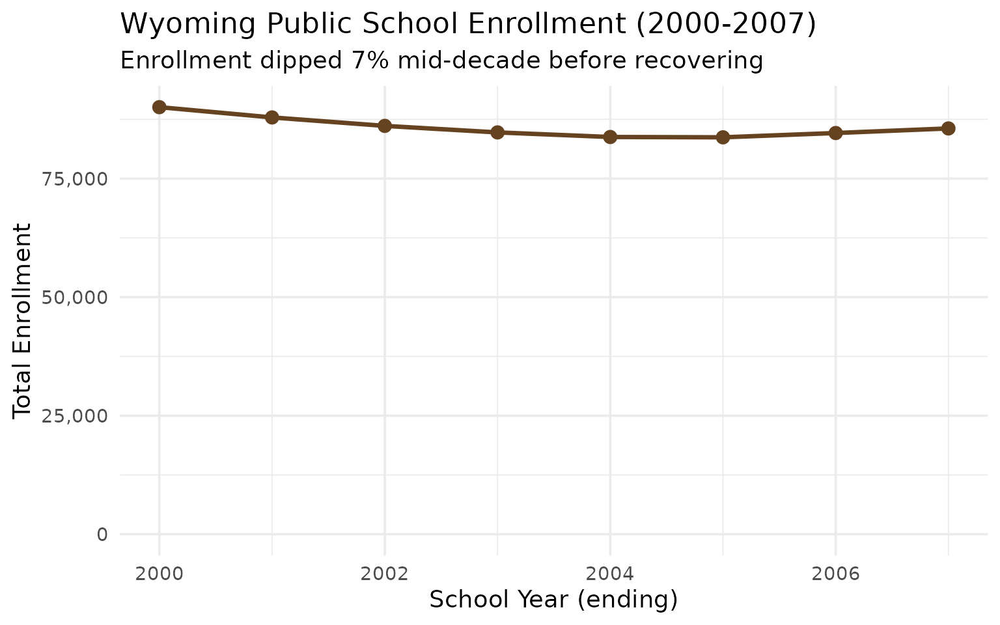

For context: Denver Public Schools alone serves more students than all
of Wyoming.

------------------------------------------------------------------------

## 2. Cheyenne and Casper alone account for more than 1 in 4 Wyoming students

Laramie \#1 (Cheyenne) and Natrona \#1 (Casper) serve more than a
quarter of the state’s students, making Wyoming a two-city school system
surrounded by vast emptiness.

``` r
top_districts <- enr_2007 |>
  filter(is_district, subgroup == "total_enrollment", grade_level == "TOTAL") |>
  arrange(desc(n_students)) |>
  head(8) |>
  select(district_name, n_students)

stopifnot(nrow(top_districts) > 0)
top_districts
#>   district_name n_students
#> 1    Laramie #1      12776
#> 2    Natrona #1      11604
#> 3   Campbell #1       7589
#> 4 Sweetwater #1       4742
#> 5     Albany #1       3507
#> 6   Sheridan #2       3080
#> 7      Uinta #1       2944
#> 8 Sweetwater #2       2599
```

``` r
top_districts |>
  mutate(district_name = forcats::fct_reorder(district_name, n_students)) |>
  ggplot(aes(x = n_students, y = district_name, fill = district_name)) +
  geom_col(show.legend = FALSE) +
  geom_text(aes(label = scales::comma(n_students)), hjust = -0.1) +
  scale_x_continuous(labels = scales::comma, expand = expansion(mult = c(0, 0.15))) +
  scale_fill_viridis_d(option = "plasma", begin = 0.2, end = 0.8) +
  labs(
    title = "Wyoming's Largest School Districts (2007)",
    subtitle = "Laramie #1 (Cheyenne) and Natrona #1 (Casper) dominate",
    x = "Number of Students",
    y = NULL
  )
```

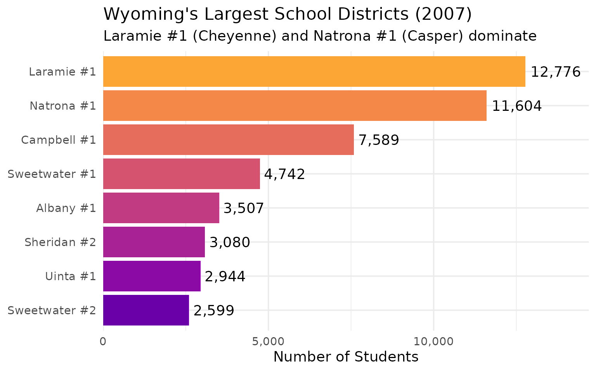

------------------------------------------------------------------------

## 3. Sublette County exploded 47% as natural gas boomed

Sublette \#1 (Pinedale) grew from 639 to 940 students between 2000 and
2007 – the fastest growth in the state – fueled by the Jonah and
Pinedale Anticline gas fields.

``` r
sublette <- enr |>
  filter(is_district, district_name == "Sublette #1",
         subgroup == "total_enrollment", grade_level == "TOTAL") |>
  select(end_year, n_students) |>
  mutate(pct_change = round((n_students / lag(n_students) - 1) * 100, 1))

stopifnot(nrow(sublette) > 0)
sublette
#>   end_year n_students pct_change
#> 1     2000        639         NA
#> 2     2001        630       -1.4
#> 3     2002        671        6.5
#> 4     2003        689        2.7
#> 5     2004        701        1.7
#> 6     2005        767        9.4
#> 7     2006        841        9.6
#> 8     2007        940       11.8
```

``` r
ggplot(sublette, aes(x = end_year, y = n_students)) +
  geom_line(linewidth = 1.2, color = "#CC6600") +
  geom_point(size = 3, color = "#CC6600") +
  scale_y_continuous(labels = scales::comma) +
  labs(
    title = "Sublette #1 (Pinedale) Enrollment (2000-2007)",
    subtitle = "Natural gas boom drove 47% enrollment growth",
    x = "School Year (ending)",
    y = "Total Enrollment"
  )
```

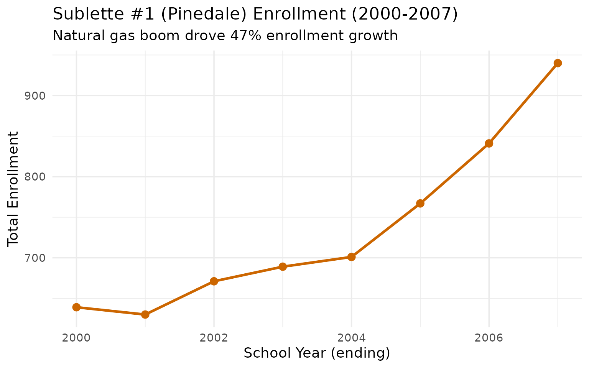

When the Jonah gas field ramped up production, Pinedale transformed from
a quiet ranching town into a boomtown.

------------------------------------------------------------------------

## 4. Fremont County lost 14% of its students in seven years

Home to the Wind River Reservation, Fremont County’s six school
districts shed nearly 1,000 students between 2000 and 2007 – the
steepest county-level decline in the state.

``` r
fremont <- enr |>
  filter(is_district, subgroup == "total_enrollment", grade_level == "TOTAL",
         grepl("Fremont", district_name)) |>
  group_by(end_year) |>
  summarize(total = sum(n_students, na.rm = TRUE)) |>
  mutate(pct_change = round((total / lag(total) - 1) * 100, 1))

stopifnot(nrow(fremont) > 0)
fremont
#> # A tibble: 8 × 3
#>   end_year total pct_change
#>      <int> <dbl>      <dbl>
#> 1     2000  7273       NA  
#> 2     2001  6639       -8.7
#> 3     2002  6504       -2  
#> 4     2003  6344       -2.5
#> 5     2004  6299       -0.7
#> 6     2005  6373        1.2
#> 7     2006  6360       -0.2
#> 8     2007  6280       -1.3
```

``` r
ggplot(fremont, aes(x = end_year, y = total)) +
  geom_line(linewidth = 1.2, color = "#8B4513") +
  geom_point(size = 3, color = "#8B4513") +
  scale_y_continuous(labels = scales::comma) +
  labs(
    title = "Fremont County Enrollment (2000-2007)",
    subtitle = "Wind River Reservation region lost nearly 1,000 students",
    x = "School Year (ending)",
    y = "Total Enrollment"
  )
```

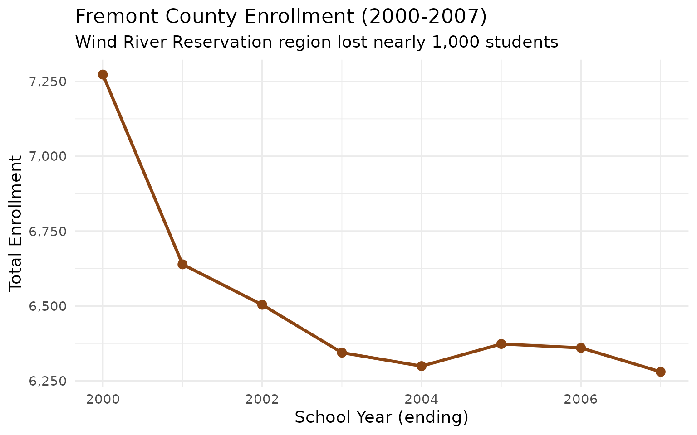

------------------------------------------------------------------------

## 5. Fremont \#38 (Wind River Reservation) lost 39% of its students

Among individual districts, Fremont \#38 experienced the most severe
decline: from 538 students in 2000 to just 328 by 2007.

``` r
fremont_districts <- enr |>
  filter(is_district, subgroup == "total_enrollment", grade_level == "TOTAL",
         grepl("Fremont", district_name)) |>
  select(end_year, district_name, n_students)

stopifnot(nrow(fremont_districts) > 0)
fremont_districts |>
  filter(end_year %in% c(2000, 2007)) |>
  pivot_wider(names_from = end_year, values_from = n_students) |>
  mutate(change = `2007` - `2000`,
         pct_change = round((`2007` / `2000` - 1) * 100, 1)) |>
  arrange(pct_change)
#> # A tibble: 8 × 5
#>   district_name `2000` `2007` change pct_change
#>   <chr>          <dbl>  <dbl>  <dbl>      <dbl>
#> 1 Fremont #38      538    328   -210      -39  
#> 2 Fremont #21      530    377   -153      -28.9
#> 3 Fremont #2       291    228    -63      -21.6
#> 4 Fremont #14      647    527   -120      -18.5
#> 5 Fremont #1      1996   1734   -262      -13.1
#> 6 Fremont #25     2540   2355   -185       -7.3
#> 7 Fremont #6       390    388     -2       -0.5
#> 8 Fremont #24      341    343      2        0.6
```

``` r
fremont_districts |>
  ggplot(aes(x = end_year, y = n_students, color = district_name)) +
  geom_line(linewidth = 1) +
  geom_point(size = 2) +
  scale_y_continuous(labels = scales::comma) +
  labs(
    title = "Fremont County District Enrollment (2000-2007)",
    subtitle = "Reservation districts experienced steepest declines",
    x = "School Year (ending)",
    y = "Enrollment",
    color = "District"
  )
```

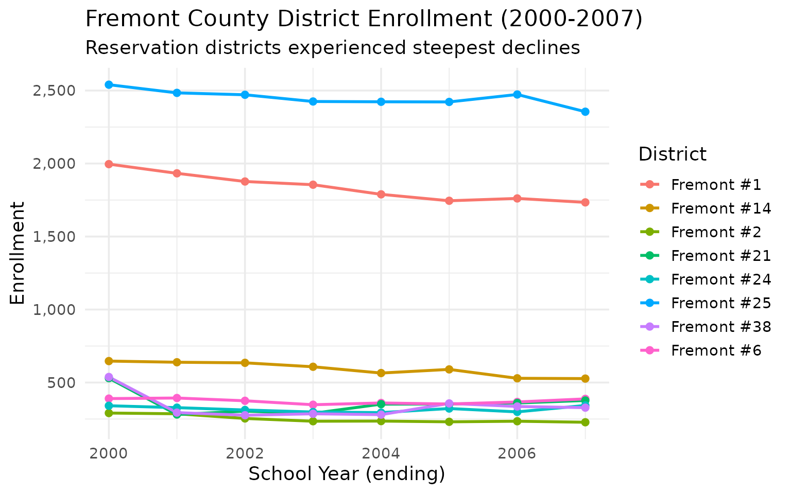

------------------------------------------------------------------------

## 6. Campbell County: Coal kept Gillette stable while the rest of Wyoming shrank

Campbell \#1 (Gillette) held nearly steady at ~7,400 students even as
the state lost 7%. The Powder River Basin coal economy provided
stability – a pattern that would reverse dramatically in later years as
coal declined.

``` r
campbell <- enr |>
  filter(is_district, subgroup == "total_enrollment", grade_level == "TOTAL",
         grepl("Campbell", district_name)) |>
  select(end_year, district_name, n_students)

campbell_summary <- campbell |>
  group_by(end_year) |>
  summarize(total = sum(n_students, na.rm = TRUE)) |>
  mutate(pct_change = round((total / lag(total) - 1) * 100, 1))

stopifnot(nrow(campbell_summary) > 0)
campbell_summary
#> # A tibble: 8 × 3
#>   end_year total pct_change
#>      <int> <dbl>      <dbl>
#> 1     2000  7488       NA  
#> 2     2001  7441       -0.6
#> 3     2002  7368       -1  
#> 4     2003  7234       -1.8
#> 5     2004  7198       -0.5
#> 6     2005  7337        1.9
#> 7     2006  7617        3.8
#> 8     2007  7589       -0.4
```

``` r
ggplot(campbell_summary, aes(x = end_year, y = total)) +
  geom_line(linewidth = 1.2, color = "#2F4F4F") +
  geom_point(size = 3, color = "#2F4F4F") +
  scale_y_continuous(labels = scales::comma) +
  labs(
    title = "Campbell County (Gillette) Enrollment (2000-2007)",
    subtitle = "Coal economy kept enrollment stable during statewide decline",
    x = "School Year (ending)",
    y = "Total Enrollment"
  )
```

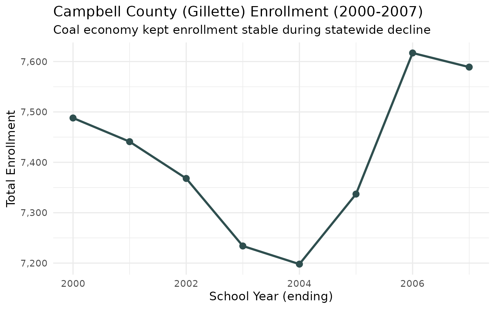

------------------------------------------------------------------------

## 7. Kindergarten overtook 12th grade: Wyoming’s demographic crossover

In 2000, Wyoming graduated 6,851 seniors but enrolled only 5,825
kindergartners. By 2007 the pipeline had flipped: 6,891 kindergartners
vs 6,212 12th graders. The state was getting younger at the bottom.

``` r
k_vs_12 <- enr |>
  filter(is_state, subgroup == "total_enrollment", grade_level %in% c("K", "12")) |>
  select(end_year, grade_level, n_students) |>
  pivot_wider(names_from = grade_level, values_from = n_students)

stopifnot(nrow(k_vs_12) > 0)
k_vs_12
#> # A tibble: 8 × 3
#>   end_year     K  `12`
#>      <int> <dbl> <dbl>
#> 1     2000  5825  6851
#> 2     2001  6002  6832
#> 3     2002  6165  6582
#> 4     2003  6224  6451
#> 5     2004  6263  6272
#> 6     2005  6381  6042
#> 7     2006  6575  6146
#> 8     2007  6891  6212
```

``` r
k_vs_12_long <- enr |>
  filter(is_state, subgroup == "total_enrollment", grade_level %in% c("K", "12")) |>
  select(end_year, grade_level, n_students)

ggplot(k_vs_12_long, aes(x = end_year, y = n_students, color = grade_level)) +
  geom_line(linewidth = 1.2) +
  geom_point(size = 3) +
  scale_y_continuous(labels = scales::comma) +
  scale_color_manual(values = c("K" = "#0072B2", "12" = "#D55E00")) +
  labs(
    title = "Kindergarten vs 12th Grade Enrollment (2000-2007)",
    subtitle = "K enrollment overtook 12th grade by 2005",
    x = "School Year (ending)",
    y = "Enrollment",
    color = "Grade"
  )
```

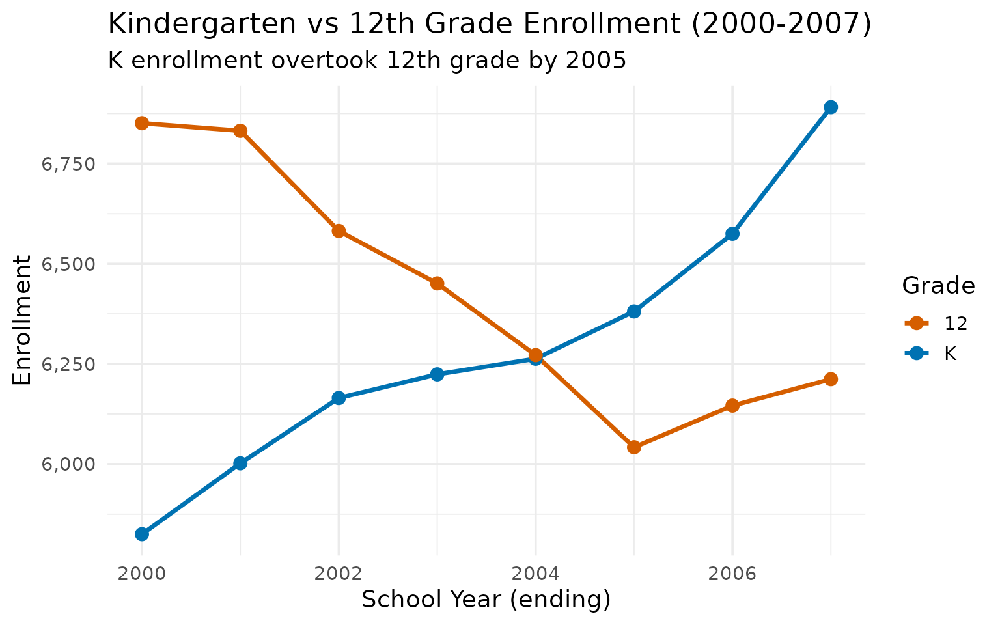

------------------------------------------------------------------------

## 8. Wyoming consolidated 28 schools in seven years

From 382 schools in 2000 to 354 in 2007, Wyoming lost 7% of its school
buildings. Rural school consolidation was reshaping the education
landscape even as enrollment began recovering.

``` r
school_counts <- enr |>
  filter(is_school, subgroup == "total_enrollment", grade_level == "TOTAL") |>
  group_by(end_year) |>
  summarize(n_schools = n(), total_students = sum(n_students, na.rm = TRUE)) |>
  mutate(avg_size = round(total_students / n_schools))

stopifnot(nrow(school_counts) > 0)
school_counts
#> # A tibble: 8 × 4
#>   end_year n_schools total_students avg_size
#>      <int>     <int>          <dbl>    <dbl>
#> 1     2000       382          90065      236
#> 2     2001       378          87897      233
#> 3     2002       377          86116      228
#> 4     2003       367          84739      231
#> 5     2004       361          83772      232
#> 6     2005       362          83705      231
#> 7     2006       359          84611      236
#> 8     2007       354          85578      242
```

``` r
ggplot(school_counts, aes(x = end_year, y = n_schools)) +
  geom_line(linewidth = 1.2, color = "#009E73") +
  geom_point(size = 3, color = "#009E73") +
  scale_y_continuous(limits = c(0, NA)) +
  labs(
    title = "Number of Wyoming Schools (2000-2007)",
    subtitle = "28 schools closed or consolidated in seven years",
    x = "School Year (ending)",
    y = "Number of Schools"
  )
```

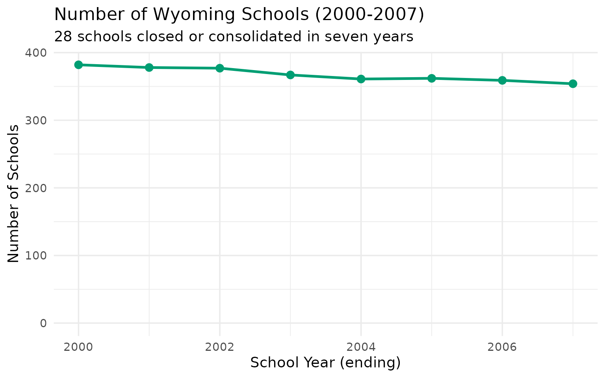

------------------------------------------------------------------------

## 9. Sweetwater County’s twin cities: Rock Springs held, Green River shrank

Rock Springs (Sweetwater \#1) and Green River (Sweetwater \#2) are 15
miles apart but had different enrollment trajectories. Rock Springs
recovered by 2007; Green River kept declining.

``` r
sweetwater <- enr |>
  filter(is_district, subgroup == "total_enrollment", grade_level == "TOTAL",
         grepl("Sweetwater", district_name)) |>
  select(end_year, district_name, n_students)

stopifnot(nrow(sweetwater) > 0)
sweetwater
#>    end_year district_name n_students
#> 1      2000 Sweetwater #1       4665
#> 2      2000 Sweetwater #2       2928
#> 3      2001 Sweetwater #1       4401
#> 4      2001 Sweetwater #2       2774
#> 5      2002 Sweetwater #1       4264
#> 6      2002 Sweetwater #2       2688
#> 7      2003 Sweetwater #1       4193
#> 8      2003 Sweetwater #2       2650
#> 9      2004 Sweetwater #1       4197
#> 10     2004 Sweetwater #2       2620
#> 11     2005 Sweetwater #1       4240
#> 12     2005 Sweetwater #2       2582
#> 13     2006 Sweetwater #1       4413
#> 14     2006 Sweetwater #2       2551
#> 15     2007 Sweetwater #1       4742
#> 16     2007 Sweetwater #2       2599
```

``` r
sweetwater |>
  ggplot(aes(x = end_year, y = n_students, color = district_name)) +
  geom_line(linewidth = 1.2) +
  geom_point(size = 2) +
  scale_y_continuous(labels = scales::comma) +
  labs(
    title = "Sweetwater County Districts (2000-2007)",
    subtitle = "Rock Springs recovered; Green River kept declining",
    x = "School Year (ending)",
    y = "Enrollment",
    color = "District"
  )
```

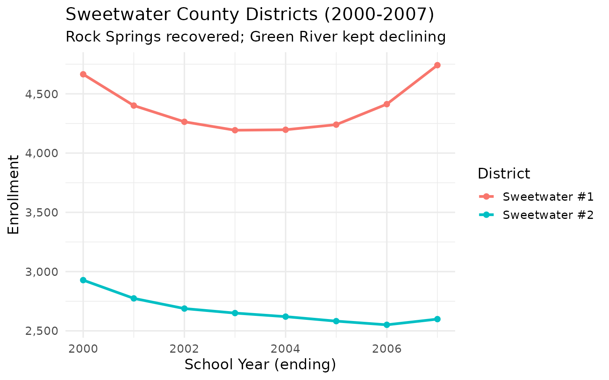

------------------------------------------------------------------------

## 10. Teton County (Jackson Hole) stayed flat while the rest of Wyoming shrank

In a state where most districts were losing students, Teton \#1 held
steady around 2,200-2,400 – Jackson’s tourism and recreation economy
insulated it from the broader decline.

``` r
teton <- enr |>
  filter(is_district, subgroup == "total_enrollment", grade_level == "TOTAL",
         grepl("Teton", district_name)) |>
  select(end_year, district_name, n_students)

stopifnot(nrow(teton) > 0)
teton
#>   end_year district_name n_students
#> 1     2000      Teton #1       2366
#> 2     2001      Teton #1       2209
#> 3     2002      Teton #1       2248
#> 4     2003      Teton #1       2296
#> 5     2004      Teton #1       2270
#> 6     2005      Teton #1       2265
#> 7     2006      Teton #1       2219
#> 8     2007      Teton #1       2270
```

``` r
teton |>
  ggplot(aes(x = end_year, y = n_students, color = district_name)) +
  geom_line(linewidth = 1.2) +
  geom_point(size = 2) +
  scale_y_continuous(labels = scales::comma) +
  labs(
    title = "Teton County (Jackson) Enrollment (2000-2007)",
    subtitle = "Tourism economy kept enrollment stable",
    x = "School Year (ending)",
    y = "Enrollment",
    color = "District"
  )
```

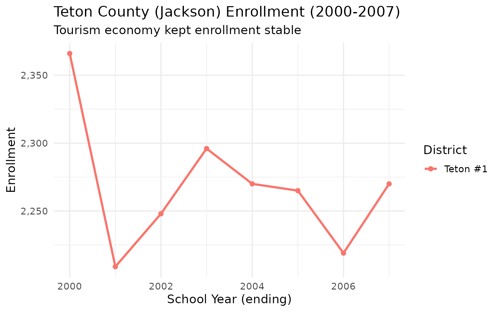

------------------------------------------------------------------------

## 11. Elementary enrollment grew while high school shrank

Between 2000 and 2007, elementary (K-5) enrollment rose from 38,545 to
39,336 (+2%) while high school (9-12) dropped from 30,172 to 26,839
(-11%). The pipeline was filling from the bottom.

``` r
elem <- enr |>
  filter(is_state, subgroup == "total_enrollment",
         grade_level %in% c("K", "01", "02", "03", "04", "05")) |>
  group_by(end_year) |>
  summarize(students = sum(n_students)) |>
  mutate(level = "Elementary (K-5)")

hs <- enr |>
  filter(is_state, subgroup == "total_enrollment",
         grade_level %in% c("09", "10", "11", "12")) |>
  group_by(end_year) |>
  summarize(students = sum(n_students)) |>
  mutate(level = "High School (9-12)")

elem_hs <- bind_rows(elem, hs)

stopifnot(nrow(elem_hs) > 0)
elem_hs
#> # A tibble: 16 × 3
#>    end_year students level             
#>       <int>    <dbl> <chr>             
#>  1     2000    38545 Elementary (K-5)  
#>  2     2001    37827 Elementary (K-5)  
#>  3     2002    37310 Elementary (K-5)  
#>  4     2003    36667 Elementary (K-5)  
#>  5     2004    36562 Elementary (K-5)  
#>  6     2005    36934 Elementary (K-5)  
#>  7     2006    38174 Elementary (K-5)  
#>  8     2007    39336 Elementary (K-5)  
#>  9     2000    30172 High School (9-12)
#> 10     2001    28863 High School (9-12)
#> 11     2002    27878 High School (9-12)
#> 12     2003    27323 High School (9-12)
#> 13     2004    27029 High School (9-12)
#> 14     2005    27007 High School (9-12)
#> 15     2006    27098 High School (9-12)
#> 16     2007    26839 High School (9-12)
```

``` r
ggplot(elem_hs, aes(x = end_year, y = students, color = level)) +
  geom_line(linewidth = 1.2) +
  geom_point(size = 3) +
  scale_y_continuous(labels = scales::comma) +
  scale_color_manual(values = c("Elementary (K-5)" = "#0072B2", "High School (9-12)" = "#D55E00")) +
  labs(
    title = "Elementary vs High School Enrollment (2000-2007)",
    subtitle = "Elementary growing while high school shrank",
    x = "School Year (ending)",
    y = "Enrollment",
    color = "Level"
  )
```

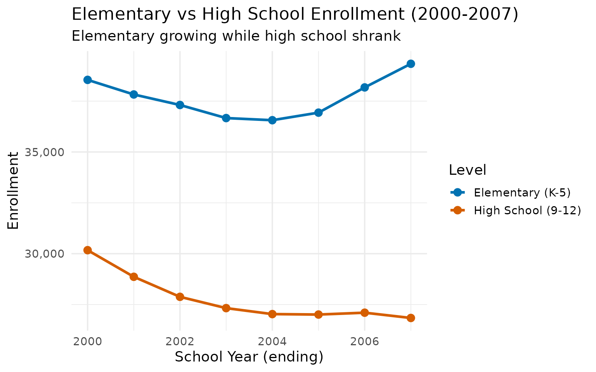

------------------------------------------------------------------------

## 12. Vast distances define Wyoming education: 48 districts across 97,000 square miles

Wyoming’s 48 school districts average about 1,780 students each, but
cover an average of 2,000 square miles per district. Many districts are
geographically larger than some eastern states.

``` r
n_districts <- enr_2007 |>
  filter(is_district, subgroup == "total_enrollment", grade_level == "TOTAL") |>
  summarize(
    n_districts = n(),
    total_students = sum(n_students, na.rm = TRUE),
    avg_per_district = round(total_students / n_districts)
  )

stopifnot(nrow(n_districts) > 0)
n_districts
#>   n_districts total_students avg_per_district
#> 1          48          85578             1783
```

With an average of fewer than 1,800 students per district, Wyoming’s
districts are intimate by national standards but geographically immense.

------------------------------------------------------------------------

## 13. Small schools are the Wyoming norm: 109 schools have under 100 students

In 2007, 109 out of 354 schools (31%) served fewer than 100 students.
Wyoming pays to keep tiny schools open across the frontier rather than
bus children hours to a larger campus.

``` r
school_sizes <- enr_2007 |>
  filter(is_school, subgroup == "total_enrollment", grade_level == "TOTAL") |>
  mutate(size_category = case_when(
    n_students < 50 ~ "Under 50",
    n_students < 100 ~ "50-99",
    n_students < 250 ~ "100-249",
    n_students < 500 ~ "250-499",
    TRUE ~ "500+"
  )) |>
  count(size_category, name = "n_schools") |>
  mutate(size_category = factor(size_category,
         levels = c("Under 50", "50-99", "100-249", "250-499", "500+")))

stopifnot(nrow(school_sizes) > 0)
school_sizes
#>   size_category n_schools
#> 1       100-249       105
#> 2       250-499       109
#> 3         50-99        36
#> 4          500+        31
#> 5      Under 50        73
```

``` r
ggplot(school_sizes, aes(x = size_category, y = n_schools, fill = size_category)) +
  geom_col(show.legend = FALSE) +
  geom_text(aes(label = n_schools), vjust = -0.3) +
  scale_fill_viridis_d(option = "mako", begin = 0.3, end = 0.8) +
  labs(
    title = "Wyoming School Size Distribution (2007)",
    subtitle = "109 schools serve fewer than 100 students",
    x = "School Size (students)",
    y = "Number of Schools"
  )
```

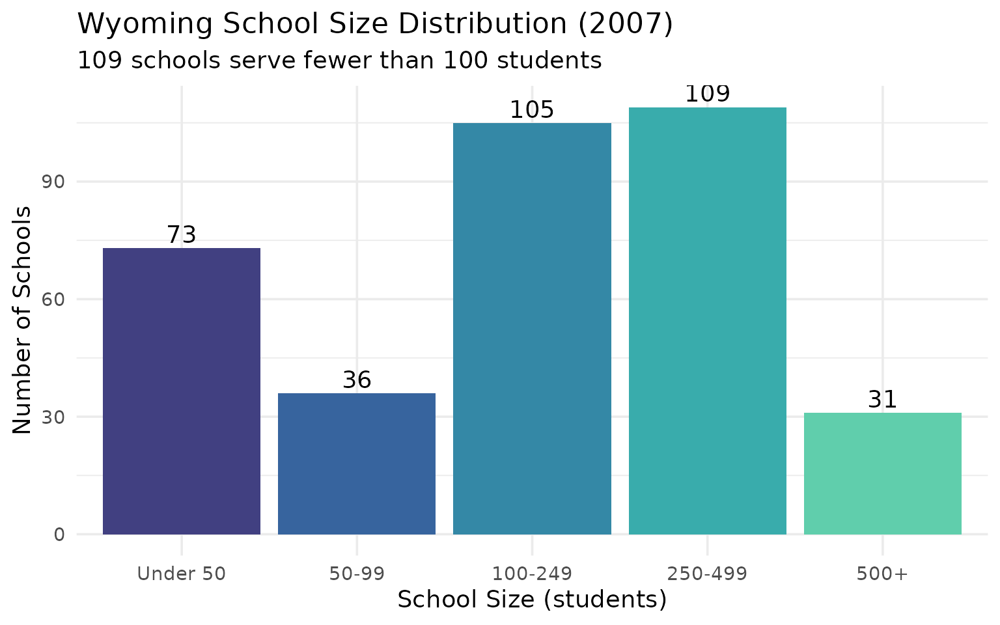

------------------------------------------------------------------------

## 14. Grade-level enrollment: 9th grade bulge reflects the demographic pipeline

The 2007 grade-level snapshot shows a pronounced 9th grade bulge (7,069
students) that shrinks to 6,212 by 12th grade – a pattern suggesting
either dropouts or outmigration in the upper grades.

``` r
grade_enr <- enr_2007 |>
  filter(is_state, subgroup == "total_enrollment",
         grade_level %in% c("K", "01", "02", "03", "04", "05",
                            "06", "07", "08", "09", "10", "11", "12")) |>
  select(grade_level, n_students) |>
  mutate(grade_level = factor(grade_level,
         levels = c("K", "01", "02", "03", "04", "05",
                    "06", "07", "08", "09", "10", "11", "12")))

stopifnot(nrow(grade_enr) > 0)
grade_enr
#>    grade_level n_students
#> 1            K       6891
#> 2           01       6565
#> 3           02       6512
#> 4           03       6485
#> 5           04       6489
#> 6           05       6394
#> 7           06       6416
#> 8           07       6321
#> 9           08       6666
#> 10          09       7069
#> 11          10       7160
#> 12          11       6398
#> 13          12       6212
```

``` r
ggplot(grade_enr, aes(x = grade_level, y = n_students, fill = grade_level)) +
  geom_col(show.legend = FALSE) +
  geom_text(aes(label = scales::comma(n_students)), vjust = -0.3, size = 3) +
  scale_y_continuous(labels = scales::comma, expand = expansion(mult = c(0, 0.1))) +
  scale_fill_viridis_d(option = "viridis") +
  labs(
    title = "Wyoming Enrollment by Grade Level (2007)",
    subtitle = "9th grade bulge shrinks by 12% through senior year",
    x = "Grade Level",
    y = "Number of Students"
  )
```

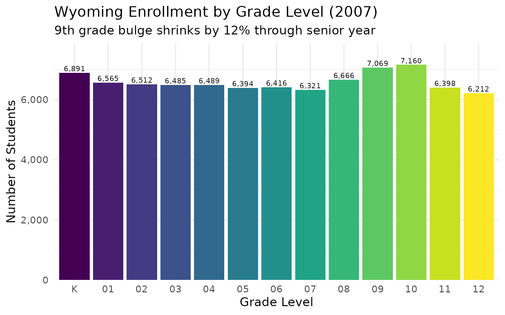

------------------------------------------------------------------------

## 15. The smallest districts: Washakie \#2 has just 96 students

Wyoming keeps schools open in communities so small that the entire
district could fit in a single classroom. Washakie \#2 (Ten Sleep)
enrolled 96 students in 2007; Sheridan \#3 (Clearmont) had 101.

``` r
smallest <- enr_2007 |>
  filter(is_district, subgroup == "total_enrollment", grade_level == "TOTAL") |>
  arrange(n_students) |>
  head(10) |>
  select(district_name, n_students)

stopifnot(nrow(smallest) > 0)
smallest
#>    district_name n_students
#> 1    Washakie #2         96
#> 2    Sheridan #3        101
#> 3       Park #16        124
#> 4     Fremont #2        228
#> 5      Platte #2        229
#> 6      Weston #7        270
#> 7    Big Horn #4        328
#> 8    Fremont #38        328
#> 9    Fremont #24        343
#> 10   Niobrara #1        364
```

``` r
smallest |>
  mutate(district_name = forcats::fct_reorder(district_name, n_students)) |>
  ggplot(aes(x = n_students, y = district_name, fill = district_name)) +
  geom_col(show.legend = FALSE) +
  geom_text(aes(label = scales::comma(n_students)), hjust = -0.1) +
  scale_x_continuous(labels = scales::comma, expand = expansion(mult = c(0, 0.2))) +
  scale_fill_viridis_d(option = "mako", begin = 0.3, end = 0.8) +
  labs(
    title = "Wyoming's Smallest School Districts (2007)",
    subtitle = "One-school towns keeping education local in the rural West",
    x = "Number of Students",
    y = NULL
  )
```

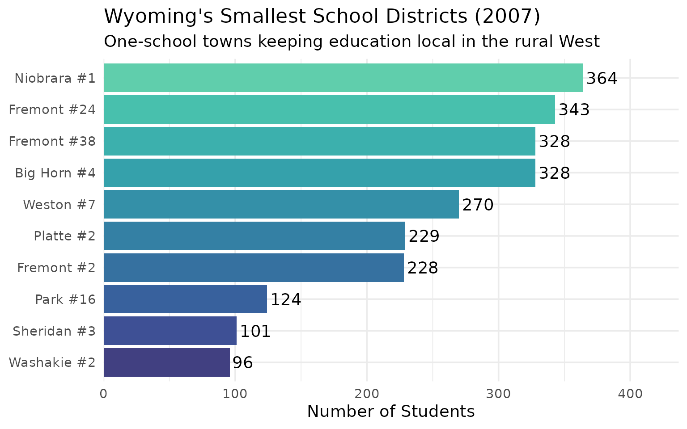

------------------------------------------------------------------------

## Summary

Wyoming’s 2000-2007 school enrollment data reveals:

- **America’s smallest system**: Under 90,000 students statewide
- **Energy-driven volatility**: State enrollment fell 7% before
  recovering with the gas boom
- **Two-city state**: Cheyenne and Casper alone account for more than 1
  in 4 students
- **Gas boom town**: Sublette County (Pinedale) grew 47% as natural gas
  production surged
- **Reservation decline**: Fremont County lost 14% of students, with
  some districts losing nearly 40%
- **Coal stability**: Campbell County held steady in an era before
  coal’s decline
- **Demographic crossover**: Kindergarten enrollment overtook 12th grade
  by 2005
- **School consolidation**: 28 schools closed between 2000 and 2007
- **Small school tradition**: 109 of 354 schools serve under 100
  students
- **Tiny districts**: Washakie \#2 (Ten Sleep) enrolled just 96 students

These patterns reflect Wyoming’s unique position as America’s least
populous state, where energy economics and vast distances shape every
aspect of public education.

------------------------------------------------------------------------

*Data sourced from the Wyoming Department of Education
[edu.wyoming.gov](https://edu.wyoming.gov/). Currently available years:
2000-2007 (PDF era). Modern era data (2008+) from the WDE reporting
portal is not currently accessible.*

------------------------------------------------------------------------

## Session Info

``` r
sessionInfo()
#> R version 4.5.2 (2025-10-31)
#> Platform: x86_64-pc-linux-gnu
#> Running under: Ubuntu 24.04.3 LTS
#> 
#> Matrix products: default
#> BLAS:   /usr/lib/x86_64-linux-gnu/openblas-pthread/libblas.so.3 
#> LAPACK: /usr/lib/x86_64-linux-gnu/openblas-pthread/libopenblasp-r0.3.26.so;  LAPACK version 3.12.0
#> 
#> locale:
#>  [1] LC_CTYPE=C.UTF-8       LC_NUMERIC=C           LC_TIME=C.UTF-8       
#>  [4] LC_COLLATE=C.UTF-8     LC_MONETARY=C.UTF-8    LC_MESSAGES=C.UTF-8   
#>  [7] LC_PAPER=C.UTF-8       LC_NAME=C              LC_ADDRESS=C          
#> [10] LC_TELEPHONE=C         LC_MEASUREMENT=C.UTF-8 LC_IDENTIFICATION=C   
#> 
#> time zone: UTC
#> tzcode source: system (glibc)
#> 
#> attached base packages:
#> [1] stats     graphics  grDevices utils     datasets  methods   base     
#> 
#> other attached packages:
#> [1] ggplot2_4.0.2      tidyr_1.3.2        dplyr_1.2.0        wyschooldata_0.1.0
#> 
#> loaded via a namespace (and not attached):
#>  [1] gtable_0.3.6       jsonlite_2.0.0     compiler_4.5.2     tidyselect_1.2.1  
#>  [5] jquerylib_0.1.4    systemfonts_1.3.1  scales_1.4.0       textshaping_1.0.4 
#>  [9] yaml_2.3.12        fastmap_1.2.0      R6_2.6.1           labeling_0.4.3    
#> [13] generics_0.1.4     knitr_1.51         forcats_1.0.1      tibble_3.3.1      
#> [17] desc_1.4.3         bslib_0.10.0       pillar_1.11.1      RColorBrewer_1.1-3
#> [21] rlang_1.1.7        utf8_1.2.6         cachem_1.1.0       xfun_0.56         
#> [25] S7_0.2.1           fs_1.6.6           sass_0.4.10        otel_0.2.0        
#> [29] viridisLite_0.4.3  cli_3.6.5          withr_3.0.2        pkgdown_2.2.0     
#> [33] magrittr_2.0.4     digest_0.6.39      grid_4.5.2         lifecycle_1.0.5   
#> [37] vctrs_0.7.1        evaluate_1.0.5     glue_1.8.0         farver_2.1.2      
#> [41] ragg_1.5.0         rmarkdown_2.30     purrr_1.2.1        tools_4.5.2       
#> [45] pkgconfig_2.0.3    htmltools_0.5.9
```
